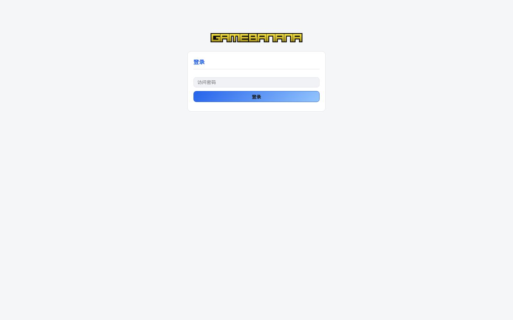
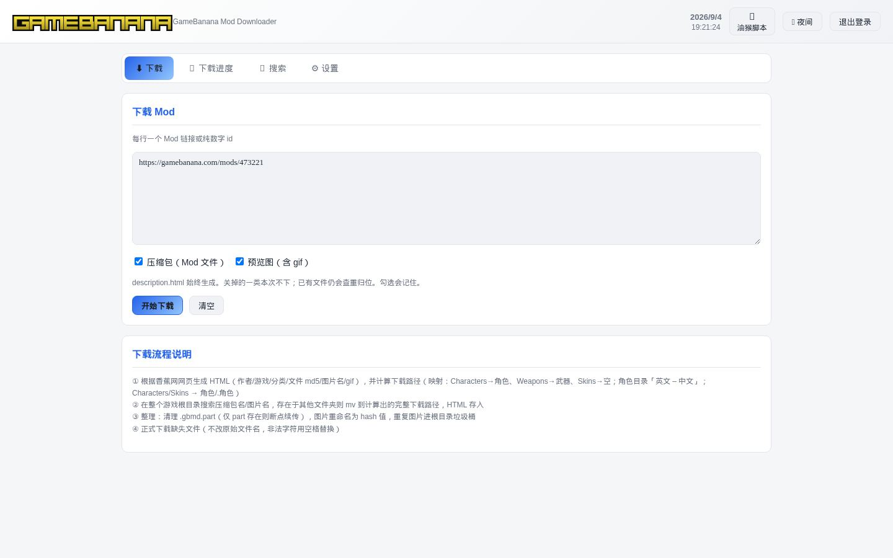
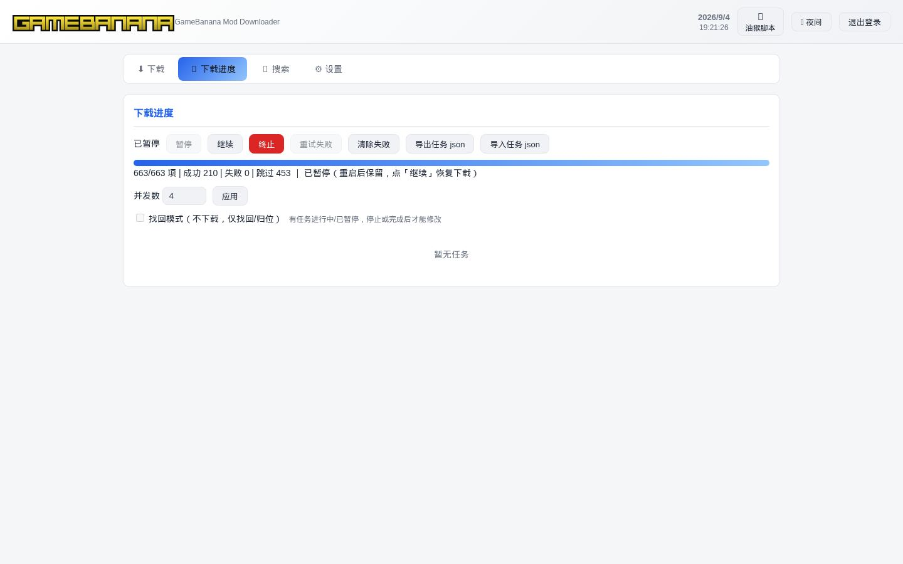
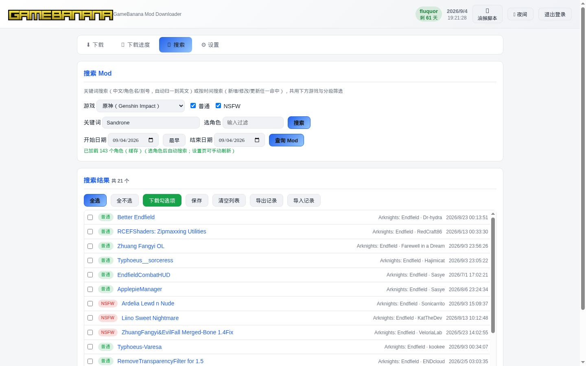
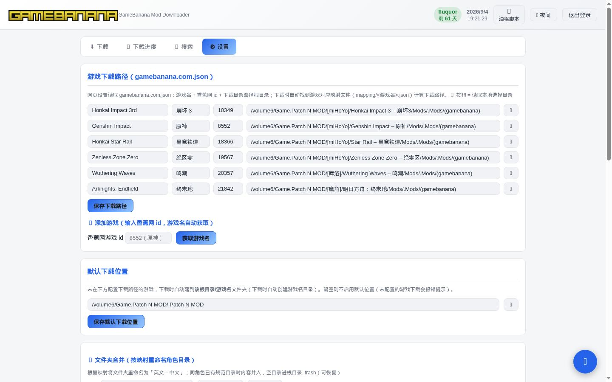
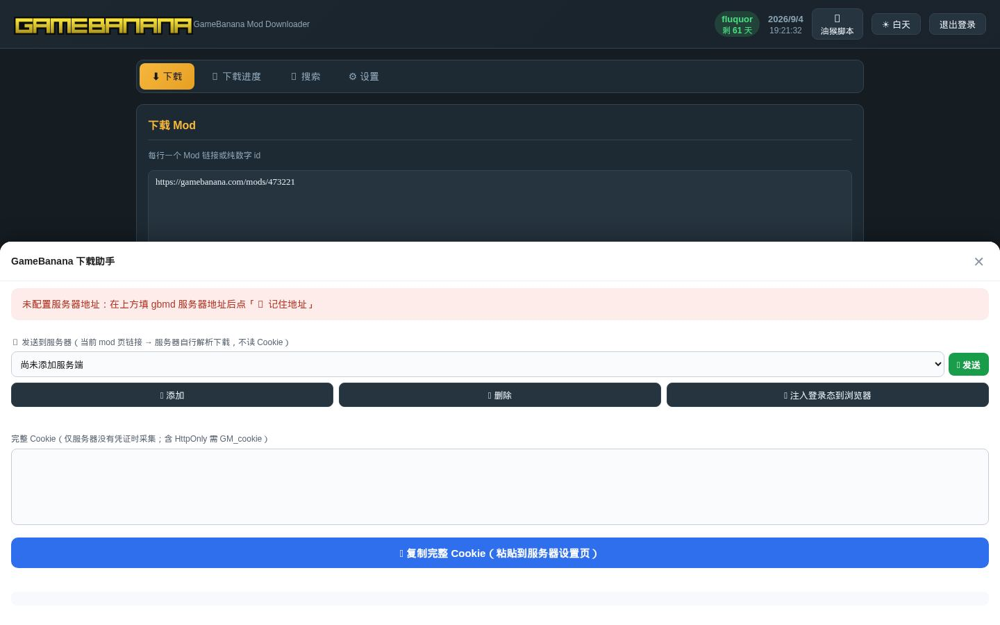
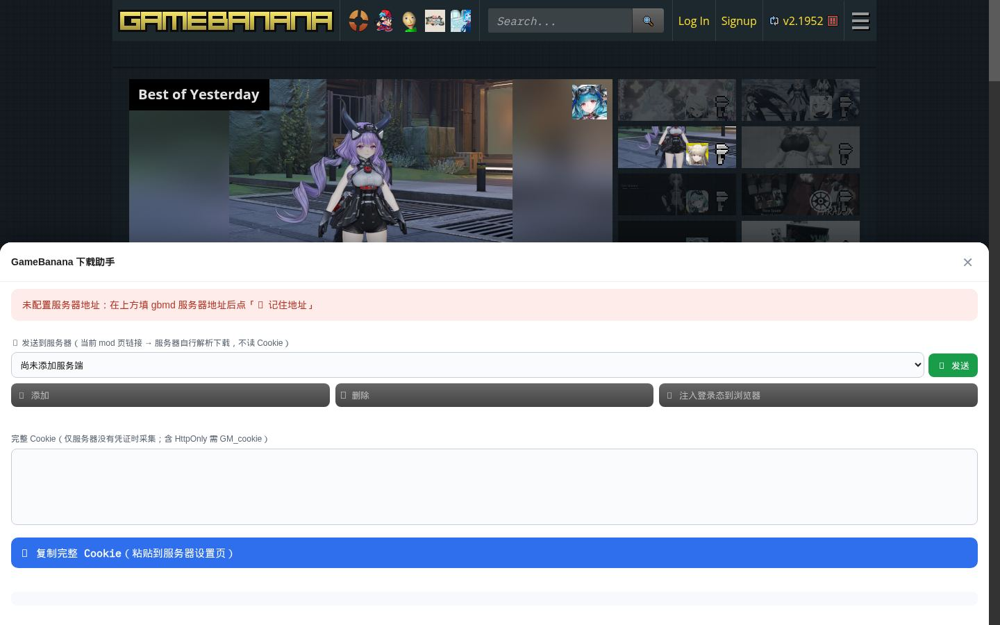

# GameBanana Mod Downloader

> 零依赖、单进程 Node.js 服务：从 [GameBanana](https://gamebanana.com) 搜索、下载并自动整理 Mod。
> 自带网页界面（浏览器访问），可选打包为桌面应用（Electron，见下文）。

**核心能力一览**

| 能力 | 说明 |
|---|---|
| 🔍 关键词搜索 | 中文/变体自动归一为英文（「桑多涅」→ Sandrone），命中 GB 全站 |
| ⏱ 按时间搜索 | 按 新增/修改/更新 三字段筛选（OR 逻辑） |
| ⬇ 四步下载流程 | 生成 HTML → 查重归位 → 整理 → 并发下载（断点续传/重试/跳过）；下载页可选压缩包 / 预览图 |
| 📁 自动整理 | 按「仓库/角色/作者」规范路径存放；旧目录自动归位、重复进回收站 |
| 🔍 HTML 反查 | 输入文件 MD5 / 图片原始短名（GB 原名）反查所属 mod；三索引（GB 线上表 + 本地表 + HTML 原名表） |
| 🗂 文件夹合并 | 纯英文目录按映射重命名为「英文 – 中文」规范名 |
| ⚙️ 网页设置 | 游戏下载路径、GB Cookie、密码、映射管理，全部网页操作 |
| 🍌 油猴脚本 | 右下角面板用服务端最新图标；服务端地址添加后下拉选择，不能改只能删 |
| 🌗 主题 | 白天 / 夜间（香蕉风）一键切换 |

---

## 快速开始

**环境要求**：Node.js 18+（零 npm 依赖，无需安装任何包）。

```bash
# 1. 下载 / 克隆仓库
git clone <仓库地址> && cd <项目目录>

# 2. （可选）设置访问密码
node server/boot.cjs --set-password "你的密码"

# 3. 启动（无参默认 restart；未运行会直接启动）
./start.sh
# 浏览器打开 http://127.0.0.1:8642
```

> 未设置密码时**只警告、可直接使用**（局域网内任何人可访问，建议尽快设置）。
> 首次启动自动生成 `server/config.json`（默认端口 8642）。
> 必须走 `server/boot.cjs`（零依赖、禁止 package.json）；启停脚本已封装。

**启停（POSIX 用 `start.sh`，Windows 用 `start-windows.bat`）**

| 命令 | 作用 |
|---|---|
| `./start.sh` | 重启（默认；未运行则直接启动） |
| `./start.sh start [--port 8642]` | 启动 |
| `./start.sh restart [--port 8642]` | 重启 |
| `./start.sh stop` | 停止（先 TERM 后 KILL，只杀 PID 文件里的进程） |
| `./start.sh status` | 状态（进程 / HTTP 健康检查 / 日志） |
| `./start.sh --set-password "新密码"` | 设置访问密码（不启动服务） |

PID 文件：项目根 `gamebanana-mods-downloader-server.pid`（不入库）。

`start-linux.sh` / `start-macos.sh` / `start-windows-background.bat` 是薄壳，转发到上面两个主入口。

终端会自动用绿/黄/红提示（管道或 `NO_COLOR` 时关闭）。日志超过 10MB 在 start/restart 时轮转并 gzip。启动前校验 `server/config.json` 是否为合法 JSON、端口是否在 1–65535。

---

## 网页界面

四个选项卡：**⬇ 下载 / 📊 下载进度 / 🔍 搜索 / ⚙ 设置**，右上角主题切换。

| 选项卡 | 功能 |
|---|---|
| 下载 | 批量输入 mod 链接或纯数字 id；可勾选「压缩包 / 预览图」（记住到设置）；一键开始 |
| 下载进度 | 每个文件的实时状态（下载中/成功/跳过/失败）、进度条、预览图；失败可单独重试/跳过；错误文本点击即可复制；无文件路径的错误项可一键清除；并发数调节 |
| 搜索 | 关键词搜索（中文归一）＋ 按时间搜索；结果勾选后一键下载 |
| 设置 | 游戏下载路径（可读取本地目录）、GB Cookie 与登录检测、映射管理、文件夹合并、HTML 反查、修改密码 |

---

## 目录结构

```
├── server/                    # 服务端（零依赖 Node.js）
│   ├── boot.cjs               # 零依赖启动器（强制本项目 .js 按 CommonJS 加载）
│   ├── app.js                 # HTTP 入口：路由/鉴权/静态页面/启动
│   ├── config.js              # 配置管理（config.json 自动初始化；读取游戏/映射）
│   ├── auth.js                # 密码 scrypt 哈希 + 会话（HttpOnly Cookie）
│   └── lib/
│       ├── gb-api.js          # GameBanana API 封装（mod 解析/搜索/NSFW 判定/Cookie）
│       ├── mapping.js         # 映射与下载路径计算（仓库层/角色层/[作者] mod名）
│       ├── downloader.js      # 四步下载流程 + 并发/断点续传/重试/跳过
│       ├── search.js          # 按时间搜索（三时间字段 OR）
│       ├── merge-dirs.js      # 文件夹合并（英文目录 → 英文 – 中文）
│       └── hash-index.js      # HTML 反查三表（GB 线上表 + 本地表 + HTML 原名表）
├── json/
│   ├── gamebanana.com.json.example  # 游戏配置示例（复制为 gamebanana.com.json 后填真实下载路径）
│   ├── index/<游戏名>.json    # HTML 反查索引（每游戏一文件：GB 线上表 + 本地表 + HTML 原名表三块，git 忽略）
│   └── role/<游戏名>.json     # 角色列表缓存（每游戏一文件）
├── mapping/                   # 每个游戏的仓库/角色映射（如 Genshin Impact.json）
├── scripts/git-push.sh        # GitHub 推送辅助（从项目本地 .git-push-token 读凭据，token 不入库）
├── scripts/gen-mapping.js     # 映射生成：按官方角色名单 + 磁盘目录反查，生成/重建 mapping/<游戏名>.json（默认 dryrun）
└── 启动脚本（start-linux.sh / start-macos.sh / start-windows*.bat）
```

---

## 游戏配置（json/gamebanana.com.json）

记录每个游戏：**英文名（key）+ 香蕉网 id + 中文名（cn）+ 下载路径（downloadPath）**。

```json
{
  "Genshin Impact": {
    "id": 8552,
    "cn": "原神",
    "downloadPath": "/path/to/your/Mods/Genshin Impact/"
  }
}
```

> ⚠️ **安全说明**：仓库只提交 `gamebanana.com.json.example`（示例路径）。
> 真实配置（含你本机下载路径）保存在本地 `gamebanana.com.json`，已被 `.gitignore` 忽略，**不会上传**。
> 首次使用：复制 example 为 gamebanana.com.json 填写路径，或在网页「设置 → 添加游戏」中配置。

**内置示例游戏**（id 为香蕉网权威 id）：

| 游戏 | 香蕉网 id | 中文名 |
|---|---|---|
| Honkai Impact 3rd | 10349 | 崩坏 3 |
| Genshin Impact | 8552 | 原神 |
| Honkai Star Rail | 18366 | 星穹铁道 |
| Zenless Zone Zero | 19567 | 绝区零 |
| Wuthering Waves | 20357 | 鸣潮 |
| Arknights: Endfield | 21842 | 终末地 |

---

## 映射（mapping/<游戏名>.json）

映射决定下载路径怎么算。格式：

```json
{
  "warehouses": { "characters": "角色", "weapons": "武器", "skins": "角色/.角色" },
  "roles": { "Sandrone": "桑多涅", "Varesa": "瓦雷莎" },
  "variants": { "桑多涅": "Sandrone", "danhenglunae": "Dan Heng Imbibitor Lunae" }
}
```

- **warehouses**：香蕉网大仓库 → 本地目录（`skins: "角色/.角色"` 表示隐藏子目录，点开头）
- **roles**：角色英文 → 中文（目录名 = `英文 – 中文`）
- **variants**：搜索归一变体（中文/别名 → 规范英文）

内置映射规模：

| 游戏 | 角色数 | 搜索变体数 |
|---|---|---|
| Genshin Impact（原神） | 137 | 736 |
| Honkai Impact 3rd（崩坏3） | 162 | 155 |
| Honkai Star Rail（星穹铁道） | 96 | 120 |
| Wuthering Waves（鸣潮） | 61 | 69 |
| Zenless Zone Zero（绝区零） | 57 | 56 |

映射可在网页「设置 → 映射管理」中**手动添加**（选游戏 → 选仓库 → 从香蕉网拉取角色列表 → 填中文名）。

---

## 下载四步流程

输入 `https://gamebanana.com/mods/704164` 或纯数字 `704164`：

**① 生成 HTML**：拉取 GB ProfilePage，生成 `description.html`（作者/游戏/分类/文件 MD5/图片/gif），并计算下载路径：
`下载根目录 / 仓库层(映射) / 角色层(英文 – 中文) / [作者] mod名`

**② 查重归位**：全游戏根目录按文件名索引，搜索压缩包名/图片名——若已存在于其他文件夹 → 整个文件夹 `mv` 到计算出的规范路径（文件全部保留，HTML 覆盖）；重复残留目录进根目录 `.trash`（可恢复）。

**③ 整理阶段**：
- `.gbmd.part` 处理：主文件 + part 都存在 → 删 part；仅 part → 保留（断点续传）
- 文件名一律按 **GB 原名**保存（压缩包/图片/gif 都不重命名；图片就是 GB 短名 `_sFile`，不是内容 MD5）

**④ 正式下载**：按 HTML 文件列表并发下载缺失文件（Range 断点续传、失败重试 3 次、停滞检测）；不改原始文件名，非法字符用空格替换。
- **下载内容勾选**（下载页，写入 `config.json` 的 `downloadToggles`）：
  - **压缩包**：GB `_aFiles` + 归档文件。关掉则第四步不入队压缩包，HTML 仍记录文件表。
  - **预览图**：GB 原图 + 简介里的 gif。关掉则图片和 gif 都不下。gif 失败仍自动跳过（不强求）。
  - `description.html` **始终生成**（查重/反查依赖它，不提供关闭）。
  - 默认两项都开，与加开关前行为一致；搜索「下载勾选项」用同一份设置。
- **归档文件**：GB 的旧归档版本（`_aArchivedFiles`，如 `xxx_sfw_7e4c1.rar`）一并下载（受「压缩包」勾选控制）
- **gif 不强求**：下载失败自动跳过（不重试、不显示失败）；下载成功才以 GB 原名加入 HTML
- **垃圾桶找回**：下载时若 `.trash` 里有同名文件（含 `dup-归位-` 前缀目录），自动找回而非重新下载

> 已存在的文件自动跳过（`_skip`）；下载完的 mod 再次下载 → 全部跳过，只补缺失项。

---

## HTML 反查（三索引）

网页「设置 → HTML 反查」：输入文件 MD5 **或图片原始短名**（GB 原名，如 `69b46e18405cc.jpg`），反查它属于哪个 mod。
**三索引设计**（2026-09-02 起索引按游戏分文件存 `json/index/<游戏名>.json`，每文件含以下三块；文件名用 mapping/sanitizeName 清洗，文件内 game 保留原始名）：

| 索引 | 内容 | git |
|---|---|---|
| GB 线上信息表 | hash → mod 名/作者/游戏/链接/GB 文件名 | ⛔ 忽略（json/index/） |
| 本地信息表 | hash → 本机实际下载目录/文件名 | ⛔ 忽略（json/index/） |
| HTML 原名表 | GB 原名（图片短名/压缩包名）→ mod | ⛔ 忽略（json/index/） |

**查询行为**：
- **本地表命中**（本机下载过）→ 显示 mod 信息 + **本机实际目录**
- **仅 GB 表命中**（线上有、本机没下）→ 显示线上信息 + **「下载此 mod」按钮**
- **HTML 原名表命中**（输入图片短名如 `69b46e18405cc.jpg`）→ 从全部 description.html 反查所属 mod
- **离线目录搜索**：按 mod 名/作者模糊搜 GB 表（无需连香蕉网），未下载的可一键下载

**索引维护**：
- 启动时自动加载三张表
- 每次新下载写完 HTML → **自动增量并入**（新 hash/原名立即可查，毫秒级）
- 全量重建：设置页「重建索引」按钮（从全部 description.html 提取，约 6000 个 HTML 热缓存 1 秒）

---

## 测试记录（实测）

### 下载与整理
- ✅ 四步流程：下载 mod → 规范路径 `角色/Varesa – 瓦雷莎/[Aiui] Varesa Winter Bikini Mod/`（zip + GB 原名图 + HTML）
- ✅ 查重归位：旧裸文件夹 `Varesa Winter Bikini Mod` 自动归位到规范路径，已存在文件全部跳过（5 项 4 跳过 1 补下）
- ✅ 旧目录移动：整批旧 mod 目录（含子目录）自动 `mv` 到规范路径，重复文件进 `.trash`（可恢复）
- ✅ 断点续传：`.gbmd.part` + Range 恢复；416/200 无 Range 时自动删 part 重下
- ✅ 失败重试/跳过：不可达图床（tumblr/tenor/patreon）标记跳过；失败项可单独重试；gif 失败自动跳过不重试
- ✅ 并发即时生效：进度页改并发数立即生效（动态限流）

### 映射与搜索
- ✅ 中文归一搜索：「桑多涅」→ Sandrone 命中；「Varesa Winter Bikini」→ 9 个候选
- ✅ 手动添加映射：选游戏 → 仓库 → 香蕉网角色列表 → 写中文名（实测 Odette/丹恒·腾荒/清宵 等）
- ✅ 添加游戏：输入香蕉网 id → 自动获取游戏名（ProfilePage）

### 绝区零/鸣潮仓库整理（2026-08-26）
- ✅ 1643 个散落 mod 目录按角色名归位到 `代理人/<角色 – 中文>/`（5818 文件移入，106 重复进 trash）
- ✅ 大写旧目录规范名归位（`CALCHARO – 卡卡罗` → `Calcharo – 卡卡罗` 等 7 个）
- ✅ 拼写变体识别（`Bernice`→柏妮思、`Ceasar`→凯撒、`Dailyn`→琉音 等 16 个）

### HTML 反查
- ✅ 真实 hash 反查：文件 MD5 / 图片内容 hash 均命中（返回 mod/目录/文件名）
- ✅ 图片短名反查：GB 原名（`69b46e18405cc.jpg`）从 HTML 记录反查所属 mod
- ✅ 增量更新：下载新 mod 后新 hash 立即可查（无需重建）
- ✅ 三表重建：GB 表 5227 条 + 本地表 11135 条 + HTML 原名表 30741 条（6000+ HTML 热缓存 ~1 秒）

### 健壮性
- ✅ 恢复任务崩溃修复：目标目录已被移走 → 标记跳过（不再 ENOENT 崩溃）；写流 error 监听兜底
- ✅ config.json 缺失自动初始化（全新 clone 启动成功）
- ✅ 数据目录重定向（Electron 打包后 asar 只读 → 可写副本）

---

## 界面截图

实际运行界面（Chromium 无头 CDP 截取）。Cookie 字段已打码。配套安装方式是油猴脚本。

| 页面 | 说明 |
|---|---|
| [登录](docs/screenshots/01-login.jpg) | 访问密码登录 |
| [下载](docs/screenshots/02-download.jpg) | 批量粘贴 mod 链接 / id，勾选压缩包与预览图 |
| [下载进度](docs/screenshots/03-progress.jpg) | 任务状态、并发、导入导出 json |
| [搜索](docs/screenshots/04-search.jpg) | 选游戏后关键词搜索，结果勾选下载 |
| [设置](docs/screenshots/05-settings.jpg) | 游戏路径、Cookie、映射、文件夹合并 |
| [油猴脚本](docs/screenshots/07-userscript.jpg) | 右下角面板：发送当前 mod 到服务器 |
| [油猴 · GameBanana 站](docs/screenshots/08-userscript-gamebanana.jpg) | 在 gamebanana.com 打开的同一面板 |















---

## 常见问题

**Q: 未设置密码能直接用吗？**
A: 可以（只警告）。但局域网内任何人可访问，建议 `node server/app.js --set-password "密码"`。

**Q: 下载的 mod 在哪？**
A: 按 `gamebanana.com.json` 里该游戏 `downloadPath` + 仓库/角色/[作者] 目录结构。

**Q: 重复文件会删吗？**
A: 不会删。整理时重复文件/目录统一移入游戏根目录 `.trash`（可恢复）。

**Q: NSFW/需登录的 mod 下不了？**
A: 在「设置」填入浏览器登录 gamebanana.com 后的完整 Cookie（`sess=...; rmc=...`），点「检测登录状态」验证。

**Q: 恢复上次未完成的任务崩溃？**
A: 已修复：恢复时目标目录不存在的项自动跳过（可能已被整理归位），不再崩溃。

---

## 版本

| 版本 | 内容 |
|---|---|
| 4.7.0 | start.sh：彩色输出、日志 10MB 轮转压缩、启动前校验 config.json、status 更详细 |
| 4.6.0 | 启停脚本统一为 start.sh / start-windows.bat；PID 写在项目根 `gamebanana-mods-downloader-server.pid` |
| 4.5.1 | 设置页改为整页长图 |
| 4.5.0 | 网页界面截图：登录 / 下载 / 进度 / 搜索 / 设置 / 油猴 |
| 4.4.3 | 按时间搜索抽 `search-date-range.js`（与 Iwara 同一份）：结束含当天到次日 0 点；结束不能晚于今天；开始晚于结束则结束跟着开始 |
| 4.4.2 | `gamebanana.com.json.example` 填 SA6400 六款游戏真实 `(gamebanana)` 路径（崩坏3/原神/星穹铁道/绝区零/鸣潮/终末地） |
| 4.4.1 | 油猴作者 EIGHTfs；服务端地址添加后下拉选择、不能改只能删；下载可选压缩包/预览图；`boot.cjs` 零依赖启动；PID 放项目根全称 |
